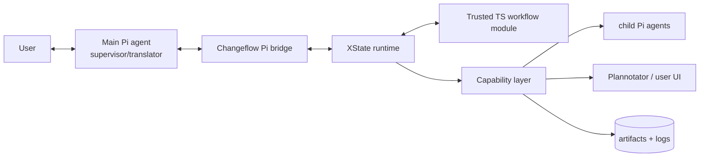
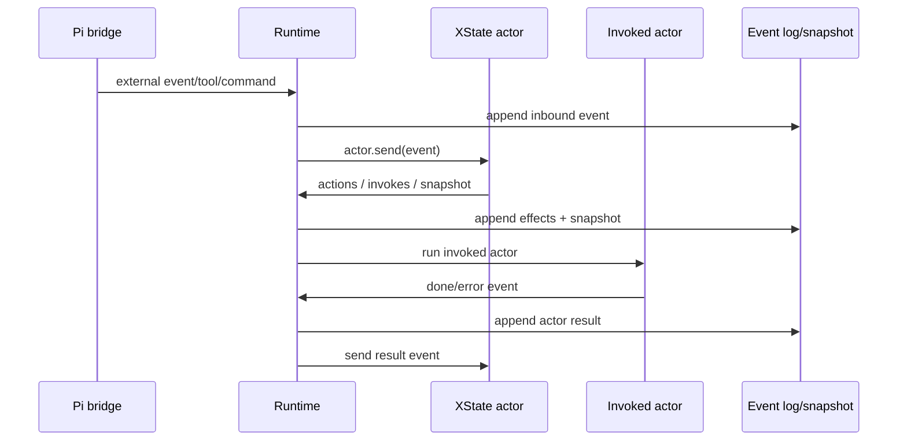

# Changeflow XState Runtime Design

## Summary

Refactor the existing `pi/extensions/changeflow` extension into a trusted TypeScript XState workflow runtime. The extension becomes a Pi harness: it loads workflow modules, persists machine state, exposes runtime capabilities, bridges Pi tools/commands into machine events, and hosts invoked actors. Workflow semantics move out of extension conditionals and into trusted XState machines.

The first bundled workflow will recreate the current Changeflow lifecycle while demonstrating the more extreme model: at least one phase invokes a child Pi agent directly from the machine and branches on its result. Backward compatibility with the current phase-specific tools is explicitly out of scope.

## Goals

- Make the XState machine the workflow brain.
- Keep the main Pi agent mostly as a supervisory/user-facing translation layer.
- Allow workflows to invoke child agents, main-agent tasks, user review, Plannotator review, scripts, and arbitrary trusted code.
- Persist an append-only event log plus XState snapshots for recovery and debugging.
- Port the current Changeflow lifecycle as the first trusted TS workflow.
- Preserve `/changeflow` as the public command namespace, but not the current tool API.

## Non-goals

- Sandbox untrusted workflow code.
- Maintain compatibility with current Changeflow tools such as `changeflow_submit_high_level_plan`.
- Implement deterministic event-log replay in the MVP.
- Make source-editing subagents parallel in the MVP.

## Architecture

Changeflow becomes a generic trusted-workflow harness with four main services.

1. **Workflow loader**: loads bundled and project-local TypeScript workflow modules, defaulting to the ported Changeflow workflow.
2. **Machine runtime**: creates and restores XState actors, sends validated events, observes snapshots, persists state, and runs invoked actors.
3. **Capability layer**: exposes trusted effects to workflow code, including logging, artifact IO, Pi status/messages, child-agent actors, main-agent actors, user-review actors, Plannotator actors, and script actors.
4. **Pi bridge**: maps slash commands, tools, lifecycle hooks, and user input into machine events; renders status; injects main-agent tasks only when the machine requests them.



## Workflow Module Contract

A workflow module exports a trusted TypeScript definition using a helper such as:

```ts
export default defineWorkflow({
  id,
  name,
  description,
  machine: ({ actors, actions, runtime }) => createMachine(machineConfig),
  eventSchemas,
  artifactTemplates,
  tools,
});
```

The workflow decides what states mean. The harness only knows how to start a workflow, send events, persist snapshots, run invoked actors, and expose workflow-declared controls.

Workflow event schemas are optional. Harness-level events are always validated. If a workflow provides schemas, incoming tool/command/user events are validated before reaching XState. If no schema exists for a workflow event, trusted workflow code handles it directly.

## Capabilities

Capabilities are split by whether the machine needs to await a result.

Fire-and-forget runtime methods can be used from XState actions:

- `runtime.log(...)`
- `runtime.writeArtifact(...)`
- `runtime.setStatus(...)`
- `runtime.emitToPi(...)`
- `runtime.queueMainAgentMessage(...)`

Awaited actor factories are used from `invoke`:

- `actors.childAgent(...)`
- `actors.mainAgent(...)`
- `actors.askUser(...)`
- `actors.plannotatorReview(...)`
- `actors.runScript(...)`

This keeps quick side effects simple while making blocking work visible in the XState actor lifecycle.

## Main Pi Agent Role

The main Pi agent is primarily a supervisory/control channel and user translator. It can inspect machine state, explain what is happening, translate user intent into workflow events, and complete machine-requested tasks.

When the machine invokes `actors.mainAgent(...)`, the bridge injects a task into the current Pi session. The task includes:

- workflow and state identifiers
- requested work
- expected completion events
- relevant artifact paths
- active edit policy
- instructions to complete the task by sending a typed machine event

Child agents are preferred for isolated autonomous work. Main-agent actors are used for conversational reasoning, supervision, ambiguous work, and user-facing translation.

## Persistence and Data Flow

The runtime persists both an append-only event log and periodic XState snapshots. Snapshots are the fast restore path. The event log is the audit/debug trail.

Proposed layout:

```text
.pi/changeflow/<workflow-id>/
├── workflow.json
├── events.jsonl
├── snapshots/
│   └── <seq>.json
├── artifacts/
│   ├── research.md
│   ├── high-level-plan.md
│   └── workflow-specific files
└── actors/
    └── <actor-run-id>/
        ├── input.json
        ├── output.json
        ├── events.jsonl
        └── logs.txt
```



Every meaningful boundary crossing is logged:

- user or main-agent submitted event
- command/tool event
- machine transition event
- action effect record
- actor start, output, error, and cancellation
- human review request and result
- snapshot sequence

On session start, the harness restores `workflow.json`, loads the workflow module, starts the machine from the latest snapshot, and reconciles pending actors or reviews where possible. If snapshot restore fails, the event log is available for diagnostics and future replay support.

## Ported Changeflow Workflow

The first bundled workflow recreates the current lifecycle:

```text
idle → research → high_level_planning → high_level_agent_review
→ high_level_user_review → detailed_planning → detailed_user_review
→ execution_ordering → executing → qa → user_validation → done
```

Behavior moves into the workflow module:

- Research, planning, execution, and QA states define main-agent task prompts.
- Human review states invoke `actors.plannotatorReview(...)` or `actors.askUser(...)`.
- Plan submission is a workflow event carrying plan content and artifact information.
- Edit/write restrictions are workflow-declared policy that the harness enforces generically.
- Subagent permissions are workflow choices, not hardcoded state-name checks in the extension.

The first “extreme” demonstration is machine-invoked high-level plan critique:

```text
high_level_planning
  └─ PLAN_SUBMITTED
      → high_level_agent_review
          invoke childAgent(reviewer)
              approved → high_level_user_review
              issues → high_level_revision
```

This proves that the machine can spawn an agent, wait for a result, branch on that result, and continue to human review or revision without making source-editing agents autonomous in the MVP.

## Pi Bridge UX

The bridge exposes generic workflow controls.

Commands:

- `/changeflow start [--workflow <id>] <description>`: create a workflow instance.
- `/changeflow status`: show state, pending actors, latest events, and artifacts.
- `/changeflow workflows`: list trusted workflow modules.
- `/changeflow send <EVENT_JSON_OR_TYPE>`: manually inject a workflow event for debugging/recovery.
- `/changeflow actors`: show active and recent actor runs.
- `/changeflow cancel-actor <id>`: cancel a child agent or script actor when possible.
- `/changeflow clear`: clear the active session pointer.

Tools for the main Pi agent:

- `changeflow_send_event`: send a typed event to the active machine.
- `changeflow_get_state`: inspect current state, expected events, pending tasks, and active edit policy.
- `changeflow_read_artifact`: read workflow-scoped artifacts.
- `changeflow_write_artifact`: write workflow-scoped artifacts.
- `changeflow_complete_main_task`: complete a machine-invoked main-agent actor.

The current phase-specific tools are removed rather than shimmed.

## Error Handling, Cancellation, and Recovery

Failures should become machine events whenever possible.

- If an invoked actor fails, the harness logs the failure and sends an error event back to the invoking state.
- Workflows decide whether failures cause retry, revision, fallback to main-agent supervision, or a terminal workflow error.
- If event validation fails, the harness rejects the event before sending it to XState and records a rejected event-log entry.
- If persistence fails, the runtime stops advancing and surfaces a hard error. It must not continue only in memory.
- If Pi reloads, the runtime restores the latest snapshot and reconciles pending reviews or actors.
- If an actor cannot be reconciled, the workflow receives a recovery event such as `ACTOR_RECOVERY_NEEDED`.

Cancellation is explicit:

- `/changeflow cancel-actor <id>` cancels child agents and scripts when possible.
- Workflows may expose cancel/retry events for review gates and long-running tasks.
- Session shutdown attempts graceful cancellation of active child processes while preserving logs.
- Main-agent actors cannot be force-cancelled the same way. The bridge marks the pending main-agent task abandoned and sends a cancellation event.

Error states are workflow-defined. The harness may report a generic degraded runtime status but should not impose a universal workflow failure model beyond persistence/load failures.

## Testing

Testing happens at three layers.

### Pure Workflow Tests

- Instantiate the ported Changeflow machine with mocked actors/runtime.
- Send events through research, planning, review, execution, and QA paths.
- Assert state transitions, invoked actor decisions, and context updates.

### Runtime and Persistence Tests

- Verify event log append and snapshot writes.
- Verify restore from snapshot.
- Verify event validation and rejected-event logging.
- Verify actor run records.
- Verify failed persistence stops advancement.
- Test actor factories with mocked Pi/subprocess/user-review adapters.

### Extension Integration Checks

- Run TypeScript checks.
- Start a workflow manually.
- Complete a path through plan submission, machine-invoked agent review, human review, execution, and QA.
- Verify tool-call edit policy blocks writes before execution.
- Verify reload restores state and pending review/actor records.

## Migration Plan

The migration happens inside `pi/extensions/changeflow`.

1. Introduce the new runtime alongside the current implementation.
2. Add trusted TS workflow loading.
3. Port the current lifecycle into a bundled workflow module.
4. Add generic bridge commands and tools.
5. Replace current hardcoded phase behavior with workflow-defined actions and actors.
6. Add the high-level plan critique child-agent actor.
7. Remove current phase-specific tools.
8. Update the README to explain the machine-as-program model.

## Implementation Defaults

- `defineWorkflow` returns a typed workflow definition object with `id`, `name`, optional `description`, `machine`, optional `eventSchemas`, optional `artifactTemplates`, and optional workflow-declared tools.
- Workflow modules are loaded from bundled workflow files and project-local `.pi/changeflow/workflows/*.ts` files. Package-style workflow directories are deferred.
- TypeBox is the default schema library for harness and workflow event schemas because the extension already uses it for Pi tools.
- The runtime writes a snapshot after every accepted external event and every completed invoked actor result.
- `events.jsonl` stores event records with snapshot sequence pointers, not full snapshot payloads inline.
